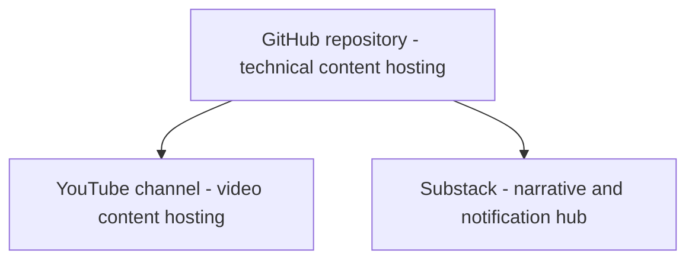

# Stack Project Docs

[john-tech-writer.github.io/stack-project-docs](https://john-tech-writer.github.io/stack-project-docs)

created 8.6.26

This repository / site / project is mainly intended to provide a general-purpose skeleton for creating a media stack for technical documentation. In this model, a GitHub repository anchors the core technical content, YouTube hosts video content, and Substack hosts narrative content. 

This stack models a robust workflow for known, well-researched technical authoring best practices:
  - Short overviews to provide context and explain concepts.
  - Illustrated procedures that clearly demonstrate tool use.
  - Short videos to give a general feel for a procedure and show specific moves difficult to capture in still photos or text.
  - Narrative content for a wider sense of context.
  - A notification hub for updates.

This model is suitable for procedural docs, conceptual / overview docs, and reference docs. If you are familiar with the DITA model, all this will seem very familiar. Also important, this site both explains and models how to organize the content in meaningful ways beyond the full-text search.

In this stack design, the media stack elements provide a ready-made audience platform for video and narrative content which points back to the core technical documents that live in the repository:



The media elements not only widen the audience reach of the repository, they also provide appropriate containers for content that doesn't fit the strictly technical nature of the repository.

This skeleton / model is suitable for a wide range of projects, from hardware-oriented maintenance and repair work to software-based workflows. The project documents here were developed over the course of about six months in parallel with a real demo project, which can be viewed at vintage-reel-service-guides.com.

The documents include not only general guidelines and structure, but also prompts to help kick-start the process of authoring content. They also include more specific, concrete instructions for tool use, which is often a very time consuming aspect of new projects. For example, basic instructions are provided for using Shotcut to create and edit videos.

This is a growing and evolving repository and will be updated regularly based on successive refactoring passes on real projects. The knowledge gained from real-work projects will be used to contiuously update this repository and add to it, making it a more useful toolkit as it grows and matures. All this project history is recorded in the [Changelog](changelog.md).

## Local preview

```bash
pip install -r requirements.txt
mkdocs serve
```

## Publish to GitHub Pages

Manual, same as the reel site:

```bash
mkdocs gh-deploy
```

Or push to `main` and let `.github/workflows/deploy.yml` build and deploy automatically. It runs on every push regardless of your Pages settings — the one-time setup step is telling Pages where to find the result: Settings → Pages → Source → **Deploy from a branch** → branch `gh-pages` → folder `/ (root)` → Save. (Don't select "GitHub Actions" as the source — that's a different deployment method this workflow doesn't use.)

## Folder layout

```
docs/
  index.md                       # Home — this is project-workflow.md
  README.md                      # Orientation to this docs set
  directory-layout.md
  naming-slugs.md
  parking-lot.md
  volume-planning.md
  image-workflow.md
  image-lists.md
  audio-video-workflow.md
  backup-workflow.md
  substack-standards-series.md
  skeletons-templates-workflow.md
  repo-skeletons/
    overview-skeleton.md         # verbatim reel-repo template — see note below
    service-guide-skeleton.md    # verbatim reel-repo template — see note below
  img/
    screen-shots/
    screencasts/
  stylesheets/
    extra.css
mkdocs.yml
requirements.txt
```

## Note on `repo-skeletons/`

`overview-skeleton.md` and `service-guide-skeleton.md` are the actual templates used to draft
new reel overview/service-guide pages on the `vintage-reel-service-guides` repo. They're
published here verbatim (bracket placeholders and all) rather than genericized, since
genericizing them isn't the point yet — they're reference copies of the real working templates.
Expect MkDocs' link/image checker to warn on their `[maker]`/`[model]`/`[link]` placeholder
paths during build; that's expected and not a real broken link in this repo.
