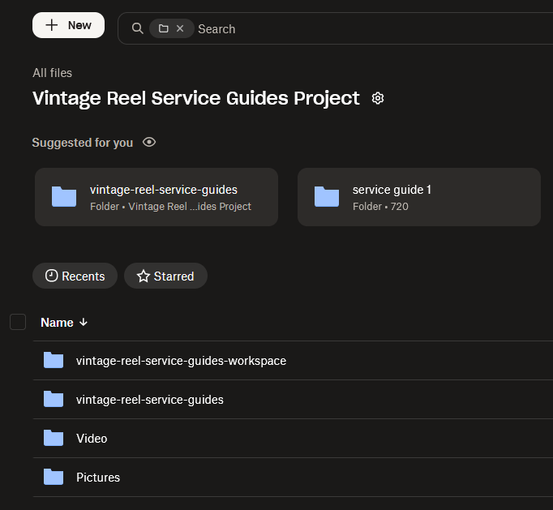

# Backup workflow

For projects that are strictly GiHub-based, such as the Stack project, there is no reason to do backups anywhere else, e.g., Dropbox. For projects that include working and media folders, like the Vintage Reels project, both GitHub and Dropbox should be used.

For day-to-day project backup, Dropbox should primarily cover the workspace and media folders, while GitHub remains the authoritative remote for Git-tracked repositories:

  - GitHub for the published docs / site source and its commit history.
  - Dropbox for project-development material, raw/final media, Shotcut/Reaper/Affinity files, and other non-repo assets.

Important exception

A Dropbox copy of a repo is not wrong; it is just redundant unless you want an independent disaster-recovery snapshot. GitHub’s own documentation describes a git clone --mirror as a way to back up a repository with its revision history, which is a better repo-specific backup than copying an active working clone with its .git directory into a syncing service.

## How Dropbox desktop sync works

When you install the Dropbox desktop app, it creates a local “Dropbox” folder and keeps that folder and your online Dropbox account in two‑way sync in the background.

For the folder you selected (your vintage reel project directory):

  - Any new local files you add into that synced folder get uploaded to Dropbox.

  - Any changes to existing local files (edits, renames) get uploaded and create new versions you can recover from history.

  - Any local deletions of files in that synced folder are mirrored as deletions in your Dropbox account (with recovery possible for a while).

Likewise, if something changes first in the Dropbox cloud copy (for example, you edit a file on another machine), those changes are pulled down and applied to the local copy on this machine.

That’s classic two‑way synchronization, not a “backup job that runs on a schedule.”

## Sync vs differential backup

What you described—“just uploads / pushes any changes… additions, deletions, and changes”—is conceptually similar to a differential or incremental backup in that only changes are transferred, not the entire dataset every time.

However:

  - Sync: Keeps two locations (local Dropbox folder and cloud) matching each other, in near real time, in both directions.

  - Differential backup: Typically one‑way; it records all changes since the last full backup when a backup job runs, and usually does not mirror deletions the same way.

Your Dropbox desktop app is doing real‑time sync, and under the hood it transfers only changed data blocks, so it behaves “like a differential” in terms of efficiency—but the logic is sync, not a traditional backup system.

## For the reel project use case

Given your workflow:

  - Treat the Dropbox‑synced project folder as “live working storage that happens to be mirrored to the cloud.”

  - You get version history and file recovery, but if you delete or corrupt something locally, that change will eventually sync to Dropbox too (though you can roll back).

If you ever want a true one‑way backup separate from the live sync (e.g., periodic snapshots of the whole reel project), you’d still want another backup strategy—like rsync/Borg to an external drive or Dropbox Backup/another service pointed at a non‑Dropbox folder.

So: yes, you understood the behavior correctly for sync, and it sounds like your setup is working as intended. The only caveat is just to remember it’s two‑way sync, not a traditional differential backup job.

## Dropbox project layout

Vintage Reel Service Guides Project/

  - Pictures/vintage reel service guides/...

  - Video/vintage reel service guides/...

  - vintage-reel-service-guides/ (repo)

  - vintage-reel-service-guides-workspace/ (project docs & reference)

<figure markdown>

<figcaption class="cap-long">Dropbox web view confirming the backup folders on the remote <code>vintage-reel-service-guides</code> repo mirror backup</figcaption>
</figure>

## Second machine (laptop) checklist

Before working on the laptop:

1. On the desktop, make sure Dropbox has finished syncing (no pending changes).

2. On the desktop, commit and push any repo changes to GitHub.

3. On the laptop, wait for Dropbox to finish syncing the Vintage Reel Service Guides Project folder.

4. In the repo on the laptop, run git pull so it matches the desktop.

While working on the laptop:

5. Edit files only in the local project folders under the Vintage Reel Service Guides Project wrapper.

When finished on the laptop:

6. Commit and push repo changes from the laptop to GitHub.

7. Leave the laptop on until Dropbox finishes syncing the Vintage Reel Service Guides Project folder.