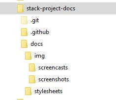
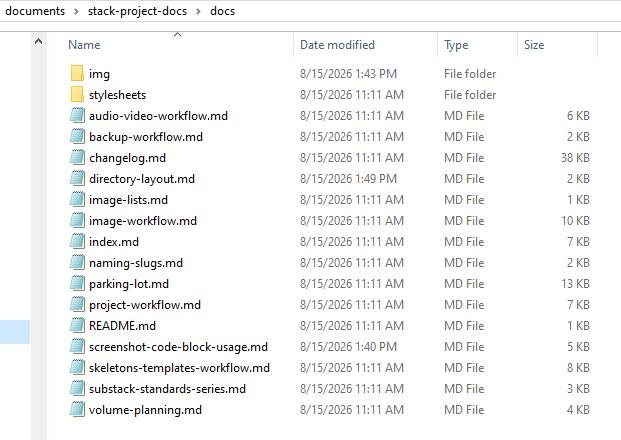

# Directory layout

This diagram shows the stack-project-docs GitHub repository structure. All project documents that get pushed to the repository live in the `docs/` folder. All images live in the `images/` subfolder.

```
- stack-project-docs/
  - .git/
  - .github/
  - docs/
    - audio-video-workflow.md
    - backup-workflow.md
    - changelog.md
    - directory-layout.md
    - image-lists.md
    - image-workflow.md
    - index.md                       # Home — the site's About... page
    - naming-slugs.md
    - parking-lot.md
    - project-workflow.md
    - README.md                      # Orientation to this doc set
    - screenshot-code-block-usage.md
    - skeletons-templates-workflow.md
    - substack-standards-series.md
    - volume-planning.md
    - img/
      - screencasts/
      - screenshots/
        - [slug].jpg
    - stylesheets/
      - extra.css
  - mkdocs.yml
  - README.md                        # Orientation to the repo
  - requirements.txt
```

The following screenshots show what the structure actually looks like in Windows Explorer.

<figure markdown>

<figcaption>File Explorer view confirming the <code>docs/img</code> asset folders in the local <code>stack-project-docs</code> repository</figcaption>
</figure>

<figure markdown>

<figcaption>File Explorer view confirming the <code>docs/</code> asset folder and files in the local <code>stack-project-docs</code> repository</figcaption>
</figure>
