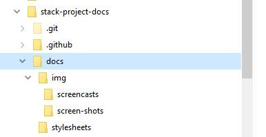

# Directory layout

```
- stack-project-docs/
  - .git/
  - .github/
  - docs/
    - index.md                       # Home — the site's About... page
    - directory-layout.md
    - naming-slugs.md
    - parking-lot.md
    - volume-planning.md
    - image-workflow.md
    - image-lists.md
    - audio-video-workflow.md
    - backup-workflow.md
    - changelog.md
    - project-workflow.md
    - substack-standards-series.md
    - skeletons-templates-workflow.md
    - img/
      - screen-shots/
      - screencasts/
    - stylesheets/
      - extra.css
  - mkdocs.yml
  - README.md                      # Orientation to this docs set
  - requirements.txt
```



<figure markdown>

<figcaption>Directory layout 1</figcaption>
</figure>

<figure markdown>

<figcaption>Directory layout 2</figcaption>
</figure>