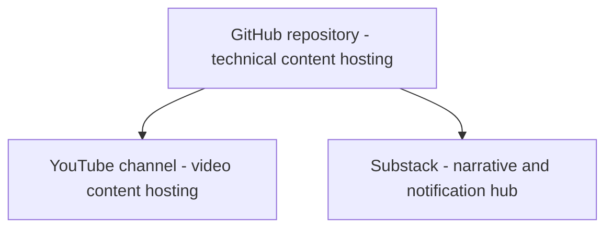

# About this repository - description - purpose

The stack-project-docs repository / site / project provides a model and methodology for creating technical documentation projects which include a media stack. In this model, a GitHub repository anchors the core technical content, YouTube hosts video content, and Substack hosts narrative content.

This model / methodology is intended to be flexible and general-purpose, but is probably best suited for how-to documentation projects which are expected to extend over multiple years and volumes.

Skeletons are provided for a set of project docs which describe the standards and workflow for:

  - A repository for core technical documentation.

  - A media hub for video content.

  - A posting hub for narrative content and notifications.

The documents include not only general guidelines and structure, but also prompts to help kick-start the process of authoring content. They also include more specific, concrete instructions for tool use, which is often a very time consuming aspect of new projects. For example, basic instructions are provided for using Shotcut to create and edit videos.

## Audience

This project is intended for solo technical writers, hobbyist experts, and small teams documenting a specific craft, repair domain, or product line — the kind of project that accumulates procedural knowledge across many volumes over several years and benefits from a repeatable, integrated repo-plus-video-plus-narrative system.

It assumes basic comfort with Markdown, Git/GitHub, and the command line, but not software engineering expertise. Markdown and GitHub skills can be developed from scratch in a few weeks of dedicated Q & A with a good AI agent.

If you're weighing whether a wiki, a single long document, or a full documentation platform fits your project, this model is built for the middle case: too much material for one file, not enough infrastructure need to justify a heavier docs platform.

## Project philosophy

**Let the real work teach what the theory should look like**. As project content is developed, standards and workflow can be abstracted and made concrete. This knowledge can be documented in a set of project documents which capture how ideas are developed and implemented over time. Iterations on lived and living, dynamic examples result in constant improvement.

Project documentation informs ongoing content development, which in turn informs the evolution of the workflow. These documents aim to describe all workflows, naming standards and directory structures, software tools, and all the rest of the machinery that moves the project forward and makes content stylistically coherent and repeatable.

Every pass on the project docs makes the workflow better and  moves the project one notch higher. Cleaning directories, tightening steps, and wiring pieces together all help to implement honest reflection of how project work is actually accomplished, not some abstract ideal.

That counts.

## Origins - where it came from

These documents were developed from a documentation project that has grown organically, so they represent best practices, tried and refined for real-world application. The basic proof of concept is in the inital project that spawned this one, so to speak - the [Vintage Reel Service Guides](https://vintage-reel-service-guides.com) repository and media stack.

After a few months of development this original project began to look like "the bow of the ship:" a good and worthy free-standing project and example, but much more than that, a demonstration project for something with much broader, Swiss-army-knife-like utility for documenting any complex how-to process, whether mechanical / industrial or software-based.

That original project housed the original project docs folder that contained docs about evolving workflow, standards, directory structure, and the past and future of the project. These project docs eventually spun off as this new free-standing repository.

## Direction - where it's going

This current iteration (August 2026) is newly spun-off from the parent project, and needs much work to become the vision of its creators. The [change log](changelog.md) provides details of the first wave of fixes, and a record. These will take some time. Meanwhile, Vintage Reel Service Guides will go on, and what's learned there will be applied here.

This project will retain the character of the Vintage Reel project because it also guides that site's development. It's a true skeleton in that it provides structure, standards, prompts, and example content. But again, the main idea here is that this is all adaptable to many other how-to documentation projects.

## Content model

This model treats project documentation as an ongoing dialogic process rather than a static, monolithic entity, and at the same time provides tools for preventing the process from becoming an infinitely expanding, difficult-to-maintain end-in-itself. Echoes of DITA can be noted in the way it divides content into procedures, concepts / overviews, and references, while remaining more flexible.

The goal here is to craft a coherent workflow for technical documentation development and ongoing management which integrates elements of the repository - version control, local authoring using simple markup for universality, and built-in support for web deployment and collaboration - wired together with already-existing video and narrative / notification platforms.

Media elements are used to widen readership, using video and narrative content which points back to the core technical documents in the repository:

